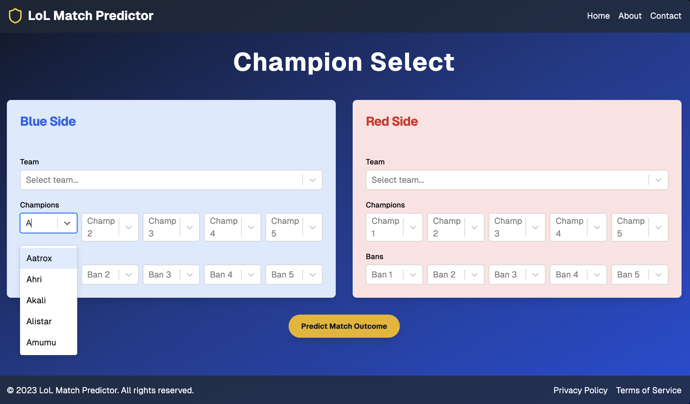

# ESport Match Predictor

## Overview

This project aims to predict the outcomes of professional esports matches, specifically focusing on the game **League of Legends (LoL)**. The prediction is based on various factors such as team compositions, champion picks, and historical performance. The project uses a **Flask** backend to provide API services and a **React** frontend for an interactive champion selection interface. The prediction model is built using **TensorFlow** and machine learning techniques.

## Features

- Champion selection for both teams (Blue and Red side) via a dynamic UI.
- Prediction of match outcomes based on selected team compositions.
- RESTful API for submitting team and champion data to the backend.
- Flask serves as the backend, handling data processing and prediction logic.
- React-based frontend for user interaction, utilizing modern UI components.



## Files

### 1. `/backend/filter_df.py`
- Reads and processes raw esports data from `'2023_LoL_esports.csv'`.
- Extracts relevant information, including team and champion picks.
- Creates rolling averages for team and opponent statistics.
- Maps champions and teams to numerical values for model compatibility.
- Splits the dataset into training and evaluation sets.
- Outputs processed data to `'LCK_training_data.csv'` and `'LCK_evaluation_data.csv'`.

### 2. `/backend/ESportModel.py`
- Builds, trains, and evaluates a machine learning model using **TensorFlow**.
- Utilizes the processed data from `'LCK_training_data.csv'` and `'LCK_evaluation_data.csv'`.
- Implements a linear classifier to predict match outcomes based on team and champion selections.

### 3. `/backend/app.py`
- Serves as the **Flask** backend, handling HTTP requests from the frontend.
- Provides API endpoints such as `/api/predict`, which accepts champion selection data and returns match outcome predictions.
- Integrates with `EsportModel.py` to compute predictions based on submitted team compositions.

### 4. `/frontend/src/components/champion-select.tsx`
- A **React component** responsible for rendering the champion selection interface.
- Allows users to select teams, champions, and bans for both the blue and red sides.
- Submits the selected champions and teams to the Flask backend via an API call for prediction.

## Dependencies

### Backend
- **Python 3.x**
- **Flask**: For serving the backend and creating API endpoints.
- **pandas**: For data manipulation and processing.
- **TensorFlow**: For building the machine learning model.
- **scikit-learn**: For data preprocessing and model evaluation.
- **jupyter** (optional): For interactive notebooks.

### Frontend
- **Node.js**: Required to run the React frontend.
- **React**: For building the user interface.
- **react-select**: For dropdowns in champion and team selection.
- **lucide-react**: For displaying icons (e.g., Shield icon).
- **typescript**: For type safety in the React application.

## Setup Instructions
  - ```bash
  - cd backend/
  - pip install -r requirements.txt
  - python app.py

  - cd ..

  - cd frontend/
  - npm install
  - npm start

## How to Use
	1.	Open the React app in your browser (http://localhost:3000).
	2.	Select teams, champions, and bans for both the blue and red sides using the Champion Select interface.
	3.	Click the Predict Match Outcome button to submit the selections.
	4.	The app will display the predicted winner based on the selections using the model hosted on the Flask backend.